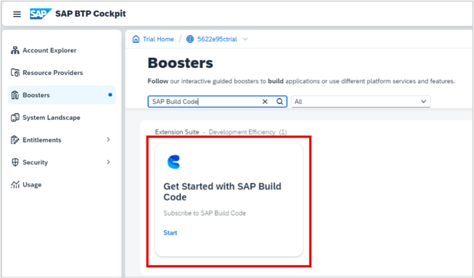

# Exercise 1 - Setup SAP Build Code in SAP BTP

## Estimated time

:clock4: 5 minutes

SAP Build Code provides a turn-key environment for coding, testing, integrations, and application lifecycle management. 

In this exercise, you will set up your system to start creating business applications in SAP Build Code. 

- [Exercise 1.1 - Run the SAP Build Code Booster](#exercise-11---run-the-sap-build-code-booster)
- [Exercise 1.2 - Verify Subscription](#exercise-12---verify-subscription)

### Exercise 1.1 - Run the SAP Build Code Booster

1. Access your [global account](https://account.hanatrial.ondemand.com/) and click **Go To Your Trial Account**.

      

2. In the navigation pane, click **Boosters**. 

      
    
3. Search for **SAP Build Code**.
   
      
    
4. Open the booster to see the overview, components, and additional resources, and click **Start**.

     

    The booster checks for required authorizations, compatible providers, and regions, as prerequisites for successful execution.

5. After running the booster, in the popup window, click **Navigate to Subaccount**.
    
     

### Exercise 1.2 - Verify Subscription

1. From the navigation pane, select **Services** > **Instances and Subscriptions**.
   
     

2. Make sure you are subscribed to SAP Business Application Studio and to SAP Build Code. 

     

3. Click **SAP Build Code**. The SAP Build lobby opens.

     

## Summary

You've successfully peformed the above preparatory steps to set up your system for creating your MDK application in SAP Build Code.

Continue to - [Exercise 2 - Create a SAP Mobile Development Kit (MDK) Application in SAP Build Code](../ex2/README.md)