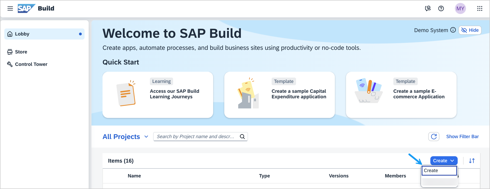
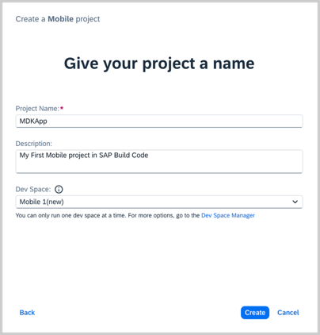
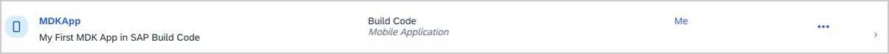
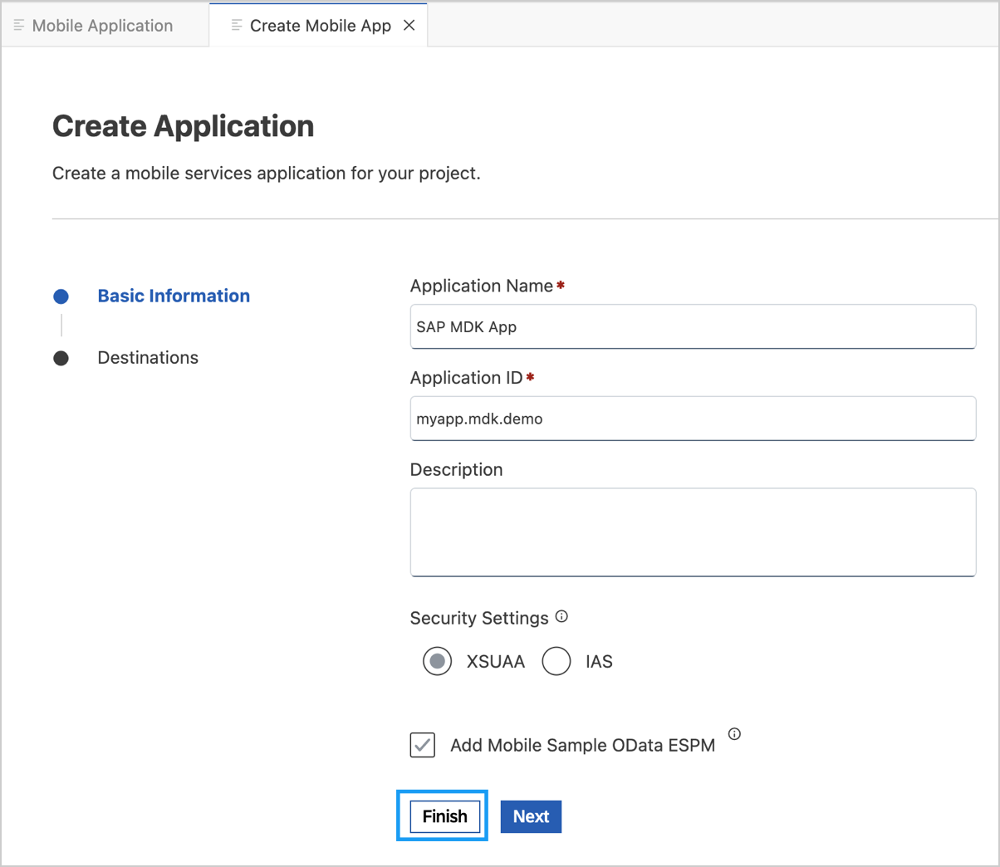
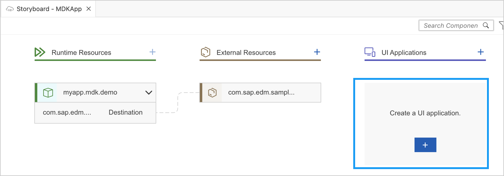

# Exercise 2 - Develop a SAP Mobile Development Kit (MDK) Application in SAP Build Code

## Estimated time

:clock4: 30 minutes

In this exercise, you will learn how to develop a SAP Mobile Development Kit (MDK) Application from the SAP Build Lobby and continue the development using the Storyboard feature in SAP Build Code development environment.

 - [Exercise 2.1 -Create a New Project Using SAP Build Code](#exercise-21---create-a-new-project-using-sap-build-code)
- [Exercise 2.2 - Configure the Application Using Storyboar](#exercise-22---configure-the-application-using-storyboard)
- [Exercise 2.3 - Deploy the application](#exercise-23---deploy-the-application)
- [Exercise 2.4 - Display the QR code for onboarding the Mobile app](#exercise-24---display-the-qr-code-for-onboarding-the-mobile-app)
- [Exercise 2.5 - Run the app](#exercise-25---run-the-app)
- [Exercise 2.6 - Explore Other Functionalities in Storyboard](#exercise-26---explore-other-functionalities-in-storyboard)

### Exercise 2.1 - Create a New Project Using SAP Build Code

1. In the SAP Build Lobby, click **Create** to start the creation process.  

     

2. Click the **Build an Application** tile.

     

3. Click the **SAP Build Code** tile to develop your project in SAP Business Application Studio, the SAP Build Code development environment, leveraging the capabilities of the services included in SAP Build Code.
   
     

4. Click the **Mobile Application** tile.
   
     

5. Enter a name for your project, add a description (optional), select the dev space where you want the project to reside, and click **Create**.

     

    >SAP Build Code recommends the dev space it deems most suitable, and it will automatically create a new one for you if you don't already have one. If you have other dev spaces of the Mobile Application type, you can select between them.

6. Your project is being created in the Project table of the lobby. The creation of the project may take a few moments. After the project has been created successfully, click the project to open it. 
   
     

    The project opens in SAP Build Code development environment.

     

    >When you open the development environment for the first time, a consent window may appear asking for permission to track your usage. Please review and provide your consent accordingly before proceeding.
    > 
    
### Exercise 2.2 - Configure the Application Using Storyboard 

The Storyboard provides a graphical view of the application's runtime resources, external resources, UI of the application, and the connections between them. This allows for a quick understanding of the application’s structure and components.

- **Runtime Resources**: In the Runtime Resources section, you can see the mobile services application and mobile destination used in the project, with a dotted-line connected to the External Resources.
- **External Resources**: In the External Resources section, you can see the external services used in the project, with a dotted-line connection to the Runtime Resource or the UI app.
- **UI Application**: In the UI Applications section, you can see the mobile applications.

1. Click on **+** button in the **Runtime Resources** column to add a mobile services app to your project. 

     

2. Sign in to your Cloud Foundry account and select the Org and Space in which you would like to create your mobile services app. Click on **Open a new browser page to generate your SSO passcode** to generate an SSO passcode.

     

3. Click on **Sign in with default identity provider**. 

     

4. Copy the Temporary Authentication Code, switch back to SAP Business Application Studio tab, paste the code into the **Enter your SSO Passcode** field, and click on **Sign In**.  

     

5. Select your Cloud Foundry Organization & Space and click on **Apply**.
    
     

6. Click on **+** button to add a new mobile service application configuration. 

    

    
    
7. In the **Basic Information** step, provide the below details and choose **Finish**.

    | Field | Value |
    |----|----|
    | `Application Name` | `SAP MDK App` |
    | `Application ID` | `myapp.mdk.demo` |
    | `Security Settings` | Leave the default value as `XSUAA`  |   
    | `Add Mobile Sample OData ESPM` | Check this option |
    
     

    >A sample OData Enterprise Sales and Procurement Model (ESPM) service is available in Mobile Services cockpit for developers to use during development and testing. 

    Creating Mobile Application may take 2-3 minutes. 
    
     

8. Once the application is in `Started` state, select the `com.sap.edm.sampleservice.v4` destination, and click on **Add App to Project**. 

     

    >You can access the mobile services admin UI by clicking on the Mobile Services option on the right hand side. 

    In the storyboard window, the app and mobile destination will be added under the Runtime Resources column. The mobile destination will also be added under the External Resources with a dotted-line connection to the Runtime Resource. The External Resource will be used to create the UI application.

     

9. Click the **+** button in the UI application column header to add mobile UI for your project.

     

10. Select the **MDK Template Type** as **CRUD**, leave the other options as they are, and click **Next**.

     

    >Since you have Enable Offline set to *Yes*, the generated application will be offline enabled. 

11. In the **Data Collections** step, provide the below information and click **Finish**:

    | Field | Value |
    |----|----|
    | `Enter a path to service (e.g. /sap/opu/odata/sap/SERVICE_NAME)` | Leave it as it is  |
    | `Select the Service Type` | Leave the default value as `OData` |
    | `Enable Offline` | It's enabled by default |
    | `Select all data collections` | Leave it as it is |
    | `What types of data will your application contain?` | Select `Customers`, `Products`, `PurchaseOrderHeaders`, `PurchaseOrderItems`, `SalesOrderHeaders` and `SalesOrderItems` |

     

12. After clicking **Finish**, the storyboard is updated displaying the UI component. The MDK project is generated in the project explorer based on your selections.
 
     

### Exercise 2.3 - Deploy the application

1. Right-click the `Application.app` file in the project explorer pane, select `MDK:Deploy`.

    

2. Select deploy target as **Mobile Services**. 

    

3. If you want to enable source for debugging the deployed bundle, then choose **Yes**.

    

    Once the deployment is successful, you will see a success message.

    

### Exercise 2.4 - Display the QR code for onboarding the Mobile app

SAP Business Application Studio has a feature to display the QR code for onboarding in the Mobile client. Click on `Application.app` to open it in MDK Application Editor, and then click the **Application QR Code** icon.

The On-boarding QR code is now displayed.

>Leave the Onboarding dialog box open for the next step.

### Exercise 2.5 - Run the app

| Steps           | Android                     | iOS                                        |
| --- | --- | --- |
| 1. Install **SAP Mobile Services Client** on your device. |  |  |
| 2. Launch the installed **`Mobile Svcs`** app. Tap **Agree** on `End User License Agreement and Privacy Statement`. |  |  |
| 3. Tap Scan button to start the device camera for scanning the onboarding QR code and grant permission to access the camera. Please note, if you already have the MDK client on-boarded, tap *Get Started* and *Scan new QR code* to continue. |  |  |
| 4. Once the scan succeeds, tap **Continue**. |  |  |
| 5. Enter your E-Mail, ID or Login Name to log into BTP. |  |  |
| 5. Enter your password to login to SAP Business Technology Platform (BTP). If you see an Universal ID screen, enter your Universal ID password. |  |  |
| 6. Create a passcode that is at least 8 characters long to unlock the app, and then tap **Next**. |  |  |
| 7. Confirm the passcode and tap **Done**. |  |  |
| 8. You have the option to enable Biometric Authentication for faster access to app data. On iOS, tap **Enable** if you wish to use this feature. On Android, provide your biometric information. |  |  |
| 9. Tap **Next**. If you want your MDK client to send you notifications such as passcode policy changes in mobile services admin UI, tap **Allow**, otherwise, tap **Don't allow**.  |   | Not Applicable |
| 10. Tap on **Now** to accept the deployed metadata definitions. |  |  |
| 11. After accepting the app update, you will see a list of entities on the **Main** page, along with a user menu that includes options such as syncing changes, accessing support, checking for updates, and resetting the app.   An offline store is initialized.   By tapping any entity, you will navigate to a list page.   If you select one of the items, the detail page will be displayed, allowing you to create, update, or delete the record.   This record will be saved to the offline request queue database.   You can navigate back to the main page and press the **Sync Changes** option in the user menu to upload any local changes to the backend.   Once the upload is successful, the app will also download data from the backend to the offline store, ensuring both sides have the same dataset.  |  |  |
| 12. Additionally, you can search through all properties of the objects displayed in the section by entering them manually or using a barcode scanner.   For instance, in the Products list, you can scan the barcode to search for products belonging to the MP3 Players category.    |  |  |

### Exercise 2.6 - Explore Other Functionalities in Storyboard

Storyboard provides functionalities to view:

- The Entity-Relationship Diagram for the OData service. 
- The page map for MDK UI application.

1. Click on `com.sap.edm....` under External Resources and select **View Diagram**.

    

2. An Entity-Relationship Digaram opens, representing OData entities, properties, and their relationships. This helps developers to view and understand the structure of OData metadata document in a graphical formats. 

    

3. Switch back to the Storyboard. Click on `mdkapp` under UI Applications and select **Open in Page Map**.

    

4. A page map view opens, representing the application flow, such as the starting page, different actions on the starting page,  navigating to other pages and so on. You can click on the edit icon to open a page in the page editor or click on action `NavTo..` to open it in the action editor. 

    

## Summary
 
You've successfully created an offline enabled mobile application using template and are able to run it on your mobile device.

Continue to - [Exercise 3 - Enhance your MDK App using Generative AI via Joule](../ex3/README.md)