# Exercise 3 - Enhance your MDK App using Generative AI via Joule

## Estimated time

:clock4: 25 minutes

In this exercise, you will learn how to enhance an MDK App using GenAI via Joule Assistant, available in the SAP Build Code development environment. You will generate an MDK page, action, and i18n resources in an existing MDK project using the Joule functionality in the Build Code.

 - [Exercise 3.1 - Generate a new MDK Page Displaying a Customer List](#exercise-31---generate-a-new-mdk-page-displaying-a-customer-list)
- [Exercise 3.2 - Navigate to the New Customer List Page](#exercise-32---navigate-to-the-new-customer-list-page)
 - [Exercise 3.3 - Generate i18n Files in One or More Languages](#exercise-33---generate-i18n-files-in-one-or-more-languages)
- [Exercise 3.4 - Add Localized String Formatter](#exercise-34---add-localized-string-formatter)
- [Exercise 3.5 -Redeploy the Application](#exercise-35---redeploy-the-application)
- [Exercise 3.6 - Run the App](#exercise-36---run-the-app)
- [Summary](#summary)

### Exercise 3.1 - Generate a New MDK Page Displaying a Customer List

The template generates a project displaying a list in an Object Table format. When navigating to the _Customers_ list in the app, you will notice that each customer has a phone number, email, etc., as contact points. Application users must manually type either the phone number or email address to contact a customer, which is quite cumbersome.
In this step, you will generate a new page or screen that allows users to contact a customer with a single tap, enhancing the user experience.

1. Open the **Joule** panel. 

    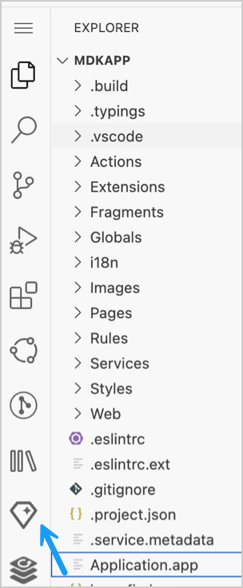 

2. Type `/` to access the available MDK commands, select `mdk-gen-page` to generate a page, choose the service file, type the following prompt, and click the play icon to generate the required information:

    ```Text
    generate a page display customer information in a contact cell control

    ```
    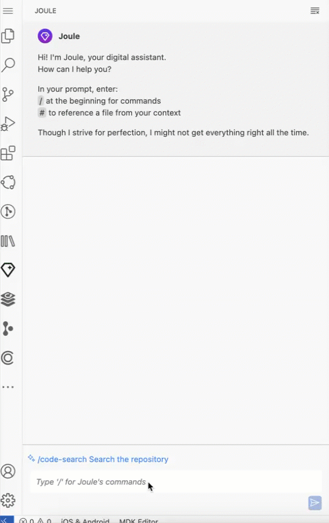 

>There is a [Contact Cell UI](https://experience.sap.com/fiori-design-ios/article/contact-cell/) available in MDK that provides quick access to various methods of communicating with a contact. 

3. Review the generated artifects/files. Once satisfied, accept all the files one by one. The accepted files will be added to the project.

    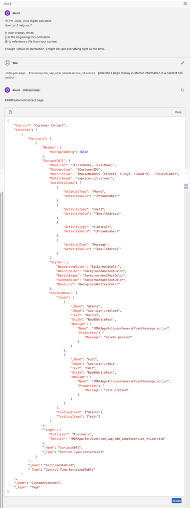 

    The Generated page is now available in the project.

    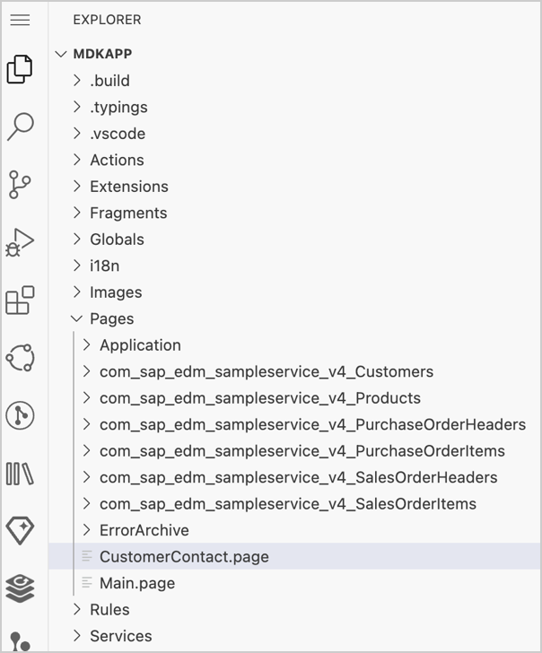   

### Exercise 3.2 - Navigate to the New Customer List Page

1. You will now bind this new page to the `Customers` button on the `Main.page`. 

    Navigate to `Pages` | `Main.page` to open it in the MDK page editor. Select `Customers`, navigate to the `Events` tab, and click the `Jump to` button. 

    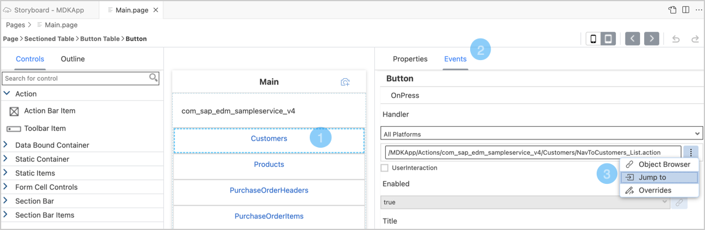 

2. When the `Customers` button is tapped on the main page, a navigation action is triggered to open a target page. With the template generated project, it is currently bound to the `/MDKApp/Pages/com_sap_edm_sampleservice_v4_Customers/Customers_List.page`. 

    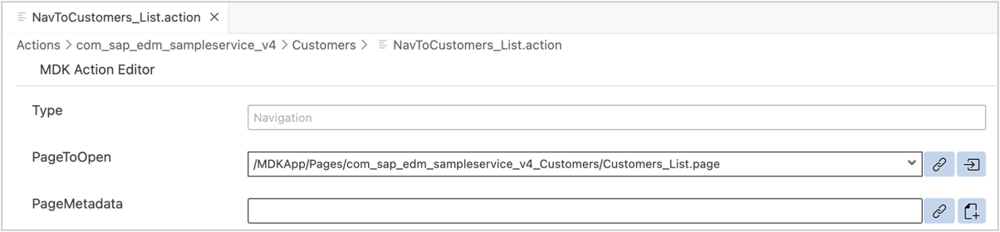 

3. Replace it with the new page generated by Joule. Click the dropdown menu and select the new page.

    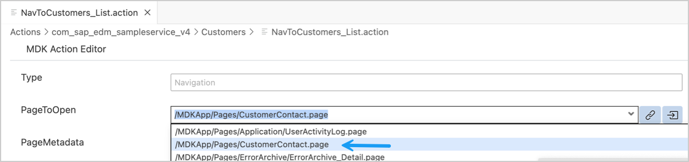 

### Exercise 3.3 - Generate i18n Files in One or More Languages 

You will now generate translation files (i18n) in one or more languages, containing key-value string pairs. This enables your application to cater to a diverse audience and ensures accessibility to users in different regions.

>**Internationalization (i18n)** is the process of designing and developing your software or mobile application product so it can be adapted and localized to different cultures, regions, and languages.

>**Localization (l10n)** is the adaptation of your software or mobile application product to meet the language, culture, and other requirements of each locale. It refers to localizing time and date differences, currency, accounting standards, culturally appropriate images, symbols, and hand gestures, spelling, and other locale-specific components.

1. Open the **Joule** panel.

2. Type `/` to access available MDK commands, select `mdk-gen-i18n` to generate the MDK i18n file, choose the first sample prompt, and click the play icon to generate the required information.

    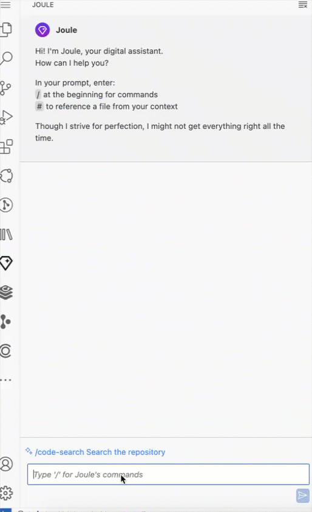 

3. Click any staging file to review its content. Once satisfied, accept all the files. Choose `Merge` option to add the generated files to your project. 

    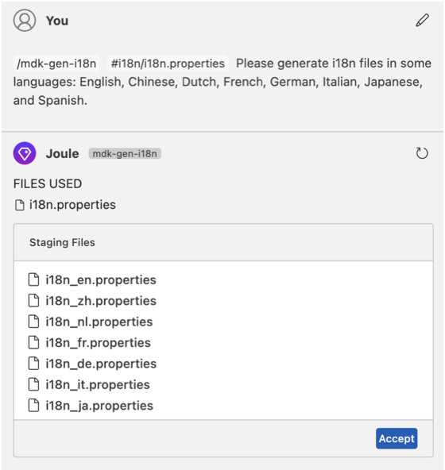 

    The Generated i18n files are now available in the project.

    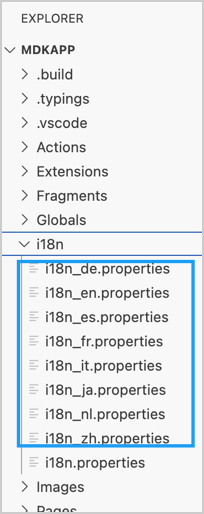  

### Exercise 3.4 - Add Localized String Formatter

MDK supports various localization formatter functions, such as Localizable String, Number, Currency, Date, Time, etc. In this exercise, you will learn use a localization formtter to localized text, such as `Product` button text available on the `Main.page`.

1. Navigate to `Pages` | `Main.page` to open it in the MDK page editor. 

2. Select the **Products** button. You will bind it to a localized string generated by Joule.

    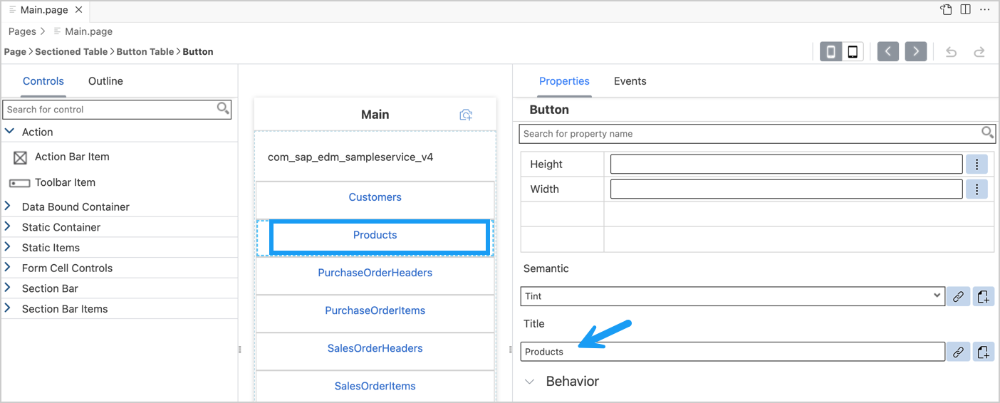 

3. In the **Properties** pane, click the **link** icon for the **Title** property.  Select **i18n Objects** from the dropdown and double-click on `Products:"Products"` to bind Title to a localizable string.

    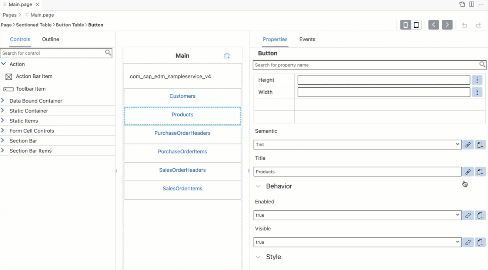 

    You may similarly set localized strings for other texts in the project. 

### Exercise 3.5 - Redeploy the Application

Right-click the `Application.app` file in the project explorer pane, select **MDK: Deploy**, and then choose the deployment target as **Mobile Services**.

### Exercise 3.6 - Run the App

| Steps&nbsp;&nbsp;&nbsp;&nbsp;&nbsp;&nbsp;&nbsp;&nbsp;&nbsp;&nbsp; | Android&nbsp;&nbsp;&nbsp;&nbsp;&nbsp;&nbsp;&nbsp;&nbsp;&nbsp;&nbsp;&nbsp;&nbsp;&nbsp;&nbsp;&nbsp;&nbsp;&nbsp;&nbsp;&nbsp;&nbsp; | iOS&nbsp;&nbsp;&nbsp;&nbsp;&nbsp;&nbsp;&nbsp;&nbsp;&nbsp;&nbsp;&nbsp;&nbsp;&nbsp;&nbsp;&nbsp;&nbsp;&nbsp;&nbsp;&nbsp;&nbsp;&nbsp;&nbsp;&nbsp;&nbsp;&nbsp;&nbsp;&nbsp;&nbsp;&nbsp;&nbsp;&nbsp;&nbsp;&nbsp;&nbsp;&nbsp;&nbsp;&nbsp;&nbsp;  |
| --- | --- | --- |
| 1. Tap **Check for Updates** in the user menu on the Main page. | 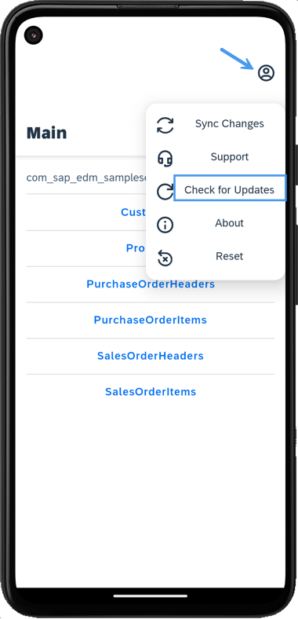 | 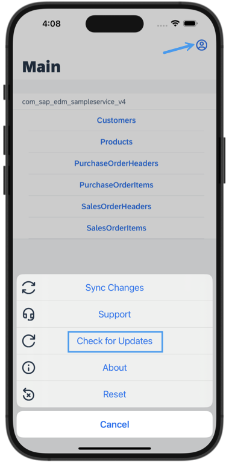 |
| 2. A _New Version Available_ pop-up will appear, tap **Now**. | 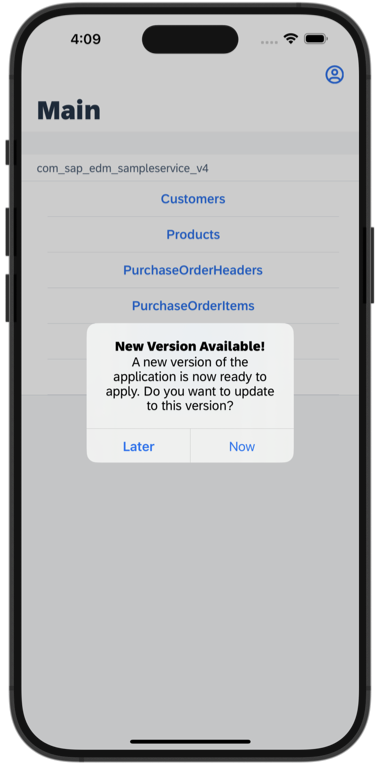 | 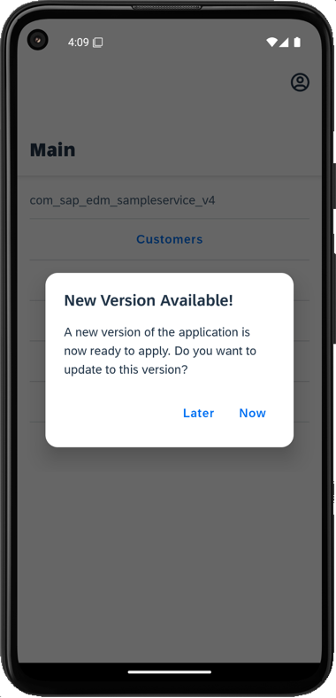 |
| 3. After accepting the app update, the latest changes will appear in the MDK client. Tap **Customers** to see the updated UI. The end user can now easily contact a customer by tapping items like call, email, etc. This page also supports swipe left and right functionality for quick actions.  | 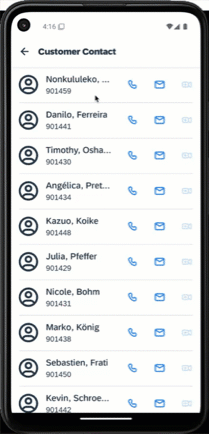 | 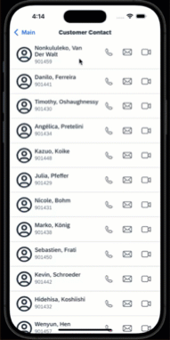 |
| 4. To test localized string changes, change the device language to one of the following: Chinese, Dutch, French, German, Italian, Japanese, or Spanish. Relaunch the MDK client to see the localized strings for the _Products_ button on the main page. These screenshots were taken when the device language was set to German.|  |  |

## Summary
 
Congratulations on successfully completing the exercises! You have learned how to develop an end-to-end mobile application in SAP Build Code and run it on your mobile device. There is always more to learn and explore. To continue advancing your skills, we encourage you to follow these [set of tutorials](https://help.sap.com/doc/f53c64b93e5140918d676b927a3cd65b/Cloud/en-US/docs-en/guides/getting-started/mdk/overview.html#tutorials) to further your mobile development journey.